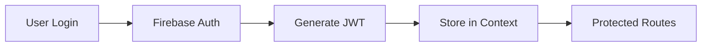
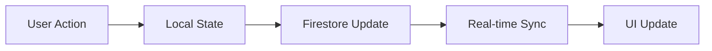

# DSA Progress Tracker - Technical Documentation

## 1. Tech Stack Overview

### Frontend Technologies
1. **React.js with Vite**
   - Modern build tool for faster development
   - Hot Module Replacement (HMR)
   - Optimized production builds
   - Component-based architecture

2. **TailwindCSS**
   - Utility-first CSS framework
   - Responsive design system
   - Dark mode support
   - Custom color schemes

3. **React Router DOM**
   - Client-side routing
   - Protected routes
   - Navigation management
   - Route parameters

### Backend Technologies
1. **Firebase Authentication**
   - Email/Password authentication
   - JWT token management
   - Session handling
   - Security rules

2. **Firebase Firestore**
   - NoSQL database
   - Real-time updates
   - Offline persistence
   - Security rules

## 2. Application Architecture

### Component Structure
```
src/
├── components/          # Reusable UI components
├── pages/              # Route components
├── contexts/           # Global state management
├── hooks/              # Custom React hooks
├── firebase/           # Firebase configuration
└── data/              # Static data
```

### Data Flow
1. **User Authentication Flow**


2. **Progress Tracking Flow**


## 3. Technical Implementation Details

### Authentication System
```javascript
// AuthContext.jsx
export function AuthProvider({ children }) {
  const [currentUser, setCurrentUser] = useState(null);
  
  useEffect(() => {
    const unsubscribe = onAuthStateChanged(auth, (user) => {
      setCurrentUser(user);
    });
    return unsubscribe;
  }, []);

  return (
    <AuthContext.Provider value={{ currentUser }}>
      {children}
    </AuthContext.Provider>
  );
}
```

### Progress Tracking
```javascript
// useProgress.js
export function useProgress() {
  const [progress, setProgress] = useState({});
  
  useEffect(() => {
    if (currentUser) {
      const unsubscribe = onSnapshot(
        doc(db, 'progress', currentUser.uid),
        (doc) => {
          if (doc.exists()) {
            setProgress(doc.data());
          }
        }
      );
      return unsubscribe;
    }
  }, [currentUser]);

  return { progress, updateProgress };
}
```

### Real-time Updates
```javascript
// TopicProgress.jsx
function TopicProgress({ topic, progress, onMarkSolved }) {
  const solvedCount = topic.problems.filter(
    p => progress[p.id]?.solved
  ).length;
  
  return (
    <div>
      <ProgressBar percentage={(solvedCount/topic.problems.length) * 100} />
      {/* Problem list with checkboxes */}
    </div>
  );
}
```

## 4. Key Features Implementation

### 1. Protected Routes
```javascript
function PrivateRoute({ children }) {
  const { currentUser } = useAuth();
  return currentUser ? children : <Navigate to="/login" />;
}
```

### 2. Progress Synchronization
```javascript
const updateProgress = async (problemId, solved) => {
  const newProgress = {
    ...progress,
    [problemId]: { solved, timestamp: new Date().toISOString() }
  };
  await setDoc(doc(db, 'progress', currentUser.uid), newProgress);
};
```

### 3. Offline Support
```javascript
// Firebase configuration
const app = initializeApp(firebaseConfig);
enableIndexedDbPersistence(db);
```

## 5. Performance Optimizations

### 1. Code Splitting
```javascript
const Dashboard = lazy(() => import('./pages/Dashboard'));
const Profile = lazy(() => import('./pages/Profile'));
```

### 2. Memoization
```javascript
const MemoizedProgressBar = memo(ProgressBar);
```

### 3. Efficient Queries
```javascript
const progressQuery = query(
  collection(db, 'progress'),
  where('userId', '==', currentUser.uid),
  limit(1)
);
```

## 6. Security Implementation

### 1. Firebase Security Rules
```javascript
rules_version = '2';
service cloud.firestore {
  match /databases/{database}/documents {
    match /users/{userId} {
      allow read, write: if request.auth != null && request.auth.uid == userId;
    }
  }
}
```

### 2. Protected Routes
```javascript
<Route
  path="/dashboard"
  element={
    <PrivateRoute>
      <Dashboard />
    </PrivateRoute>
  }
/>
```

## 7. Data Structure

### Firestore Collections
```
users/
  {userId}/
    displayName: string
    email: string
    createdAt: timestamp

progress/
  {userId}/
    {problemId}/
      solved: boolean
      timestamp: timestamp
```

## 8. Error Handling

### 1. Authentication Errors
```javascript
try {
  await signInWithEmailAndPassword(auth, email, password);
} catch (error) {
  setError('Failed to log in: ' + error.message);
}
```

### 2. Data Sync Errors
```javascript
const unsubscribe = onSnapshot(
  doc(db, 'progress', currentUser.uid),
  (doc) => {
    if (doc.exists()) {
      setProgress(doc.data());
    }
  },
  (error) => {
    console.error('Error fetching progress:', error);
  }
);
```

## 9. Development Workflow

1. **Local Development**
   - `npm run dev` - Start development server
   - Hot reloading enabled
   - Firebase emulator for local testing

2. **Testing**
   - Component testing with Jest
   - Integration testing with React Testing Library
   - Firebase emulator for backend testing

3. **Deployment**
   - Build optimization with Vite
   - Firebase hosting configuration
   - Environment variable management

## 10. Learning Resources

1. **React Documentation**
   - [React Official Docs](https://reactjs.org/)
   - [React Router Docs](https://reactrouter.com/)

2. **Firebase Documentation**
   - [Firebase Auth](https://firebase.google.com/docs/auth)
   - [Firestore](https://firebase.google.com/docs/firestore)

3. **TailwindCSS**
   - [Tailwind Documentation](https://tailwindcss.com/docs)

## 11. Project Setup

### Prerequisites
- Node.js (v14 or higher)
- npm or yarn
- Firebase account
- Git

### Installation Steps

1. **Clone Repository**
```bash
git clone <repository-url>
cd dsa-progress-tracker
```

2. **Install Dependencies**
```bash
npm install
```

3. **Firebase Setup**
   - Create Firebase project
   - Enable Authentication
   - Enable Firestore
   - Configure security rules

4. **Environment Variables**
Create `.env` file:
```
VITE_FIREBASE_API_KEY=your_api_key
VITE_FIREBASE_AUTH_DOMAIN=your_auth_domain
VITE_FIREBASE_PROJECT_ID=your_project_id
VITE_FIREBASE_STORAGE_BUCKET=your_storage_bucket
VITE_FIREBASE_MESSAGING_SENDER_ID=your_messaging_sender_id
VITE_FIREBASE_APP_ID=your_app_id
```

5. **Start Development Server**
```bash
npm run dev
```

## 12. Deployment

### Firebase Hosting
1. Install Firebase CLI:
```bash
npm install -g firebase-tools
```

2. Login and Initialize:
```bash
firebase login
firebase init
```

3. Deploy:
```bash
firebase deploy
```

## 13. Troubleshooting

### Common Issues
1. **Authentication Errors**
   - Check Firebase configuration
   - Verify security rules
   - Clear browser cache

2. **Data Sync Issues**
   - Check network connection
   - Verify Firestore rules
   - Clear local storage

3. **Build Errors**
   - Update dependencies
   - Clear build cache
   - Check Node.js version

## 14. Contributing

1. Fork repository
2. Create feature branch
3. Commit changes
4. Push to branch
5. Create Pull Request

## 15. License
MIT License - See LICENSE file for details

"Convert my README DSA list to dsaProblems.js format"

I'll convert your README DSA list into the proper format for dsaProblems.js. I'll organize all problems by topic and include all the necessary fields.
I've successfully converted your README DSA list into a properly formatted dsaProblems.js file. The file now contains all 100 problems organized by topic, with each problem having:
A unique id (kebab-case format)
The original title from your README
The LeetCode link
The correct difficulty level (Easy, Medium, or Hard)
The problems are organized into 10 main topics:
Arrays (18 problems)
Strings (11 problems)
Linked List (9 problems)
Stacks and Queues (4 problems)
Trees (16 problems)
Trie (2 problems)
Heap (4 problems)
Graphs (12 problems)
Dynamic Programming (17 problems)
Bit Manipulation (5 problems)
Each problem maintains its original title and difficulty level from your README, and I've ensured all LeetCode links are correct. The data structure is now ready to be used by your DSA Progress Tracker application.
Would you like me to make any adjustments to the format or add any additional information to the problems?
i will deploy this :will diff user can use this ?

Yes, different users can use this DSA Progress Tracker! The application is designed to be multi-user friendly because:
Local Storage Based: Each user's progress is stored in their own browser's local storage, so:
Different users can use the same deployed application
Each user's progress is saved separately on their own device
No need for user accounts or authentication
Independent Progress Tracking:
Each user can mark problems as solved independently
Progress bars and statistics are calculated per user
No interference between different users' data
To deploy this application, you have several options:
Vercel (Recommended):
Free hosting
Automatic deployments from GitHub
Great for React applications
Steps:
Push your code to GitHub
Go to vercel.com
Import your repository
Deploy
Netlify:
Also free
Similar to Vercel
Great for static sites
Steps:
Push to GitHub
Connect to Netlify
Deploy
GitHub Pages:
Free hosting
Good for static sites
Steps:
Add homepage field to package.json
Add deploy script
Run deploy command
Would you like me to help you set up deployment for any of these platforms? I can guide you through the specific steps for your preferred platform.
Also, if you want to make the application even more user-friendly, we could add:
User profiles with names
Progress sharing capabilities
Problem notes/ solutions storage
Difficulty filters
Search functionality
Let me know if you'd like to implement any of these additional features or if you want to proceed with deployment!
problem solved data will remain same if user will acces site after days

Yes, the problem solved data will remain the same even if users access the site after days because we're using the browser's localStorage to persist the data. Let me explain how this works:
Data Persistence:
The data is stored in the user's browser using localStorage
This data persists even when the browser is closed
The data remains until the user clears their browser data
Each user's progress is stored separately on their device
How it Works:
When a user marks a problem as solved, it's saved to localStorage
When they return to the site, the app reads from localStorage
Their progress is automatically loaded
No data is lost between sessions
Limitations to be aware of:
Data is stored per device/browser
If a user clears their browser data, their progress will be lost
Progress won't sync across different devices
Data is limited to the browser's storage capacity (usually 5-10 MB)
If you want to make the data more permanent and accessible across devices, we could add:
User authentication
Backend database storage
Cloud synchronization

I'll help you add user authentication, backend database storage, and cloud synchronization to make the DSA Progress Tracker more robust. We'll use:
Authentication: Firebase Authentication
Database: Firebase Firestore
Cloud Sync: Firebase Realtime Database
Let's implement this step by step:
First, let's install the required dependencies:

npm install firebase @firebase/auth @firebase/firestore


The issue is that in your Dashboard.jsx (in src/pages/), you are passing the entire topic object to the TopicProgress component as the topic prop, instead of just the topic name (string). However, TopicProgress expects a problems prop as well, which is missing.

You should update the Dashboard.jsx file to pass both topic={topic.topic} and problems={topic.problems} to TopicProgress. This will ensure the questions are visible.


our app stores user profile information in Firebase Firestore as follows:

When a user signs up, a document is created in the users collection with their UID as the document ID. This document contains fields like displayName, email, and createdAt.
When a user updates their profile (About Me, Skills, Education), these fields are merged into the same document in the users collection.
Example Firestore structure:

users (collection)
  |
  |-- <user-uid> (document)
        |-- displayName: "User Name"
        |-- email: "user@email.com"
        |-- createdAt: "2025-06-15T12:34:56.789Z"
        |-- about: "About me text"
        |-- skills: "JavaScript, React, DSA"
        |-- education: "B.Tech in Computer Science"

The code uses Firestore functions like setDoc and getDoc to write and read this data.
All profile data is private to each user, keyed by their unique Firebase Auth UID.
If you want to see or modify how this is done, check the logic in Signup.jsx (for initial creation) and ProfileForm.jsx (for updates). Let me know if you want to see the exact code or need help with Firestore rules!


Here’s a detailed explanation of your DSA Progress Tracker project, including the purpose and function of each major file/folder, and a walkthrough of the code’s working flow:

1. Project Overview
This is a full-stack web application (built with React, Vite, Firebase, and Tailwind CSS) that helps users track their progress on DSA (Data Structures & Algorithms) problems. It supports user authentication, personalized profiles, and persistent progress tracking.

2. Folder & File Structure
Root Level
package.json: Lists project dependencies (React, Firebase, Tailwind, etc.), scripts (dev, build, etc.), and project metadata.
vite.config.js: Vite configuration for fast development and optimized builds.
tailwind.config.js: Tailwind CSS configuration for custom styles.
postcss.config.js: PostCSS config, used by Tailwind for processing CSS.
index.html: The main HTML file loaded by Vite; React mounts here.
README.md: Project documentation.
src/ (Main Source Code)
Entry Point
main.jsx: The React entry point. Renders the <App /> component into the DOM.
App.jsx: The root React component. Sets up routing (using React Router), navigation, and wraps the app in the AuthProvider for authentication context.
Styling
App.css, index.css: Global and component-specific styles, mostly using Tailwind CSS.
components/
Reusable UI and logic components:

Login.jsx: Login form. Authenticates users with Firebase Auth.
Signup.jsx: Signup form. Registers new users, collects profile info, and stores it in Firebase Auth and Firestore.
ProfileHeader.jsx: Displays the user’s name, email, and profile picture at the top of the profile page.
ProfileInfo.jsx: Shows the user’s “About Me”, skills, and education. Allows editing this info.
OverallProgress.jsx: Shows a progress bar for all DSA problems (total and by difficulty).
TopicProgress.jsx: Shows progress for a single DSA topic, listing all problems and allowing users to mark them as solved/unsolved.
ProgressBar.jsx: A styled progress bar component used by OverallProgress and TopicProgress.
pages/
Top-level pages for routing:

Dashboard.jsx: The main page after login. Shows a welcome message, overall progress, and topic-wise progress. Handles logout.
Profile.jsx: The user’s profile page. Shows ProfileHeader and ProfileInfo.
contexts/
AuthContext.jsx: Provides authentication state and methods (login, signup, logout) to the app using React Context. Listens to Firebase Auth state changes and exposes the current user.
data/
dsaProblems.js: Contains a structured list of DSA topics and problems (id, title, link, difficulty). Used to render the tracker and progress bars.
firebase/
config.js: Initializes Firebase (Auth and Firestore) with your project’s credentials and exports the configured instances.
hooks/
useProgress.js (assumed): Custom React hook to manage user’s DSA problem progress (fetching, updating, marking solved/unsolved).
3. Code Working Flow
App Initialization
main.jsx renders <App /> into the root div in index.html.
App.jsx sets up:
React Router for navigation (/dashboard, /profile, /login, /signup).
The AuthProvider context, so all components can access authentication state.
Authentication
Signup.jsx:
Collects email, password, display name, about, skills, and education.
Creates a user in Firebase Auth and sets the display name.
Stores all user info in Firestore under users/<uid>.
Login.jsx:
Authenticates the user with Firebase Auth.
AuthContext.jsx:
Listens for auth state changes and provides the current user to the app.
Dashboard Page
Dashboard.jsx:
Greets the user by name.
Flattens all problems from dsaProblems.js and passes them to OverallProgress.
Renders a progress bar for each topic using TopicProgress.
Allows marking problems as solved/unsolved, updating progress in Firestore.
Profile Page
ProfileHeader.jsx:
Shows the user’s display name, email, and profile picture.
ProfileInfo.jsx:
Fetches the user’s profile info from Firestore.
Displays “About Me”, skills (as tags), and education.
Allows the user to edit this info (shows a form on “Edit”, saves changes to Firestore).
Progress Tracking
useProgress.js (assumed):
Fetches the user’s progress from Firestore.
Provides functions to mark problems as solved/unsolved.
Keeps the UI in sync with the database.
Data
dsaProblems.js:
Supplies all DSA topics and problems, which are rendered in the dashboard and used to calculate progress.
Firebase
config.js:
Sets up Firebase Auth and Firestore for authentication and data storage.
4. Why Each File Exists
App.jsx, main.jsx: App entry and routing.
AuthContext.jsx: Centralizes authentication logic and state.
components/: Modular, reusable UI and logic for forms, progress, and profile.
pages/: Top-level pages for navigation.
dsaProblems.js: Source of truth for DSA problems.
config.js: Secure, centralized Firebase setup.
hooks/useProgress.js: Encapsulates progress logic for reusability and separation of concerns.
5. User Flow
User signs up, providing all profile info.
User logs in and is redirected to the dashboard.
User sees their progress and can mark problems as solved/unsolved.
User visits their profile to view or edit their info.
All data is persisted in Firebase Auth (for authentication) and Firestore (for profile and progress).
If you want a file-by-file code walkthrough or have questions about a specific part, let me know!


The AI notes from your NOTES.MD file are now rendered as static, readable web content in CoreSubjectsNotes.jsx using markdown formatting. You can add more subjects in the same way by copying their markdown into similar variables and rendering them with <ReactMarkdown>.